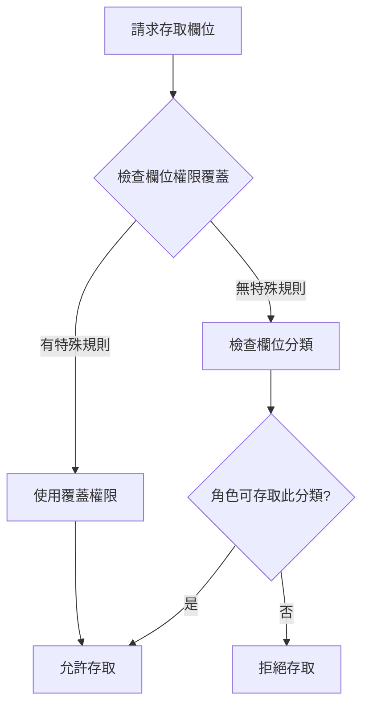

# 資料分類與存取控制說明

## 概述

本文檔說明系統中實施的**資料分類系統 (Data Classification)** 與**存取控制矩陣 (Access Control Matrix)**，提供基於角色的細粒度權限控制 (RBAC - Role-Based Access Control)。

**版本**: 1.0
**日期**: 2026-01-31
**適用**: Phase 2.3 資料分類與存取控制

---

## 目錄

1. [什麼是資料分類](#什麼是資料分類)
2. [資料分類層級](#資料分類層級)
3. [角色與權限](#角色與權限)
4. [欄位級權限控制](#欄位級權限控制)
5. [特殊規則](#特殊規則)
6. [實作架構](#實作架構)
7. [使用範例](#使用範例)
8. [測試與驗證](#測試與驗證)
9. [常見問題](#常見問題)

---

## 什麼是資料分類

**資料分類 (Data Classification)** 是將資料依照敏感度劃分為不同層級的管理方式，確保不同敏感度的資料受到適當的保護。

### 為什麼需要資料分類？

1. **合規要求**：GDPR、HIPAA 等法規要求對敏感資料進行分類與保護
2. **最小權限原則**：僅授予使用者完成工作所需的最低權限
3. **資料洩漏防護**：限制敏感資料的存取範圍
4. **審計與追蹤**：明確記錄誰在何時存取了哪些敏感資料

### 核心概念

```
資料分類層級 → 角色存取權限 → 欄位級過濾 → 返回給前端的資料
```

系統根據使用者角色與資料分類，自動過濾敏感欄位，確保使用者只能看到被授權的資料。

---

## 資料分類層級

系統定義了四個資料分類層級，由低到高為：

### 1. PUBLIC（公開資料）

**定義**：可公開存取的資料，不涉及個人隱私或敏感資訊。

**範例欄位**：
- `id`：資料記錄 ID
- `createdAt`：創建時間
- `updatedAt`：更新時間

**存取控制**：所有角色皆可存取

---

### 2. INTERNAL（內部資料）

**定義**：組織內部資料，僅限組織成員存取。

**範例欄位**：
- `organizationId`：組織 ID
- `tags`：標籤
- `groups`：群組
- `username`：使用者帳號
- `role`：使用者角色

**存取控制**：所有角色皆可存取（組織內部）

---

### 3. CONFIDENTIAL（機密資料）

**定義**：機密資料，包含個人身份資訊 (PII)，需要特定權限才能存取。

**範例欄位**：
- `name`：病患姓名
- `phone`：聯絡電話
- `email`：電子郵件
- `birthDate`：出生日期
- `address`：地址
- `gender`：性別

**存取控制**：
- **super_admin**：完整存取 ✅
- **admin**：完整存取 ✅
- **user**：完整存取 ✅

---

### 4. RESTRICTED（高度機密資料）

**定義**：高度機密醫療資料，僅限授權人員存取，需要審計追蹤。

**範例欄位**：
- `medicalHistory`：病歷
- `allergies`：過敏資訊
- `emergencyContact`：緊急聯絡人
- `bloodType`：血型
- `chiefComplaint`：主訴
- `assessment`：評估
- `plan`：治療計劃
- `notes`：醫療筆記

**存取控制**：
- **super_admin**：完整存取 ✅
- **admin**：完整存取 ✅
- **user**：**預設不可存取** ❌（除非有特殊權限覆蓋）

---

## 角色與權限

系統定義了三種角色，每種角色有不同的權限範圍。

### 1. Super Admin（超級管理員）

**權限範圍**：
- ✅ **跨組織存取**：可存取所有組織的資料
- ✅ **完整資源操作**：CREATE、READ、UPDATE、DELETE、EXPORT
- ✅ **所有資料分類**：PUBLIC、INTERNAL、CONFIDENTIAL、RESTRICTED
- ✅ **審計日誌存取**：可查看所有審計記錄
- ✅ **組織管理**：可創建、修改、刪除組織

**典型使用者**：系統管理員、技術支援

---

### 2. Admin（組織管理員）

**權限範圍**：
- ✅ **組織內資料完整操作**：CREATE、READ、UPDATE、DELETE、EXPORT
- ✅ **所有資料分類**（組織內）：PUBLIC、INTERNAL、CONFIDENTIAL、RESTRICTED
- ✅ **審計日誌存取**（組織內）：可查看組織內審計記錄
- ✅ **使用者管理**（組織內）：可創建、修改、刪除組織內使用者
- ✅ **資料匯出**：可匯出組織內資料
- ❌ **跨組織存取**：不可存取其他組織資料

**典型使用者**：診所院長、部門主管

---

### 3. User（一般使用者）

**權限範圍**：
- ✅ **病患資料**：CREATE、READ、UPDATE
- ✅ **諮詢記錄**：CREATE、READ、UPDATE
- ✅ **預約管理**：CREATE、READ、UPDATE、DELETE
- ✅ **資料分類存取**：PUBLIC、INTERNAL、CONFIDENTIAL
- ❌ **RESTRICTED 資料**：預設不可存取（除非有特殊權限）
- ❌ **刪除病患**：不可刪除病患
- ❌ **資料匯出**：不可匯出資料
- ❌ **審計日誌**：不可存取審計日誌

**特殊權限覆蓋**（基於安全考量）：
- ✅ `allergies`（過敏資訊）：可讀可寫（用藥安全）
- ✅ `medicalHistory`（病歷）：可讀（診斷參考）
- ✅ `notes`（醫療筆記）：可讀可寫

**典型使用者**：醫師、護理師、櫃檯人員

---

## 欄位級權限控制

### 權限檢查流程



### 欄位權限覆蓋 (Field Permission Overrides)

某些欄位因為業務需求，需要特殊的權限設定：

#### 病患資料 (`patients`)

| 欄位 | 分類 | User 權限 | 原因 |
|------|------|-----------|------|
| `medicalHistory` | RESTRICTED | READ | 診斷參考，需要查看病歷 |
| `allergies` | RESTRICTED | READ, UPDATE | 用藥安全，必須能更新過敏資訊 |
| `notes` | RESTRICTED | READ, UPDATE | 醫療筆記，需要讀寫 |

#### 諮詢記錄 (`consultations`)

| 欄位 | 分類 | User 權限 | 原因 |
|------|------|-----------|------|
| `chiefComplaint` | RESTRICTED | CREATE, READ, UPDATE | 主訴記錄 |
| `assessment` | RESTRICTED | CREATE, READ, UPDATE | 診斷評估 |
| `plan` | RESTRICTED | CREATE, READ, UPDATE | 治療計劃 |
| `notes` | RESTRICTED | CREATE, READ, UPDATE | 診療筆記 |

#### 使用者資料 (`users`)

| 欄位 | 分類 | 所有角色 | 原因 |
|------|------|---------|------|
| `password` | RESTRICTED | **永不返回** | 安全考量，密碼不可被讀取 |

---

## 特殊規則

### 1. 跨組織存取 (Cross Organization Access)

**說明**：允許存取其他組織的資料

**權限**：
- Super Admin: ✅
- Admin: ❌
- User: ❌

---

### 2. 修改其他使用者 (Can Modify Other Users)

**說明**：可以修改其他使用者的資料

**權限**：
- Super Admin: ✅
- Admin: ✅（組織內）
- User: ❌（僅可修改自己）

---

### 3. 刪除病患 (Can Delete Patients)

**說明**：可以刪除病患記錄

**權限**：
- Super Admin: ✅
- Admin: ✅
- User: ❌

---

### 4. 匯出資料 (Can Export Data)

**說明**：可以匯出資料為 Excel/CSV 等格式

**權限**：
- Super Admin: ✅
- Admin: ✅
- User: ❌

---

### 5. 存取審計日誌 (Can Access Audit Logs)

**說明**：可以查看審計日誌

**權限**：
- Super Admin: ✅
- Admin: ✅（組織內）
- User: ❌

---

## 實作架構

### 檔案結構

```
server/
├── config/
│   ├── dataClassification.js          # 資料分類配置
│   ├── accessControlMatrix.js         # 存取控制矩陣
│   └── test-access-control.js         # 測試腳本
├── middleware/
│   └── accessControl.js               # 存取控制中介層
└── routes/
    ├── patients.js                    # 病患路由（已整合欄位過濾）
    └── consultations.js               # 諮詢路由（已整合欄位過濾）
```

### 核心模組

#### 1. `dataClassification.js`

定義資料表與欄位的分類層級：

```javascript
const FieldClassification = {
  patients: {
    name: DataClassification.CONFIDENTIAL,
    phone: DataClassification.CONFIDENTIAL,
    medicalHistory: DataClassification.RESTRICTED,
    allergies: DataClassification.RESTRICTED,
    // ...
  },
  // ...
};
```

#### 2. `accessControlMatrix.js`

定義角色對資源的操作權限：

```javascript
const ResourcePermissions = {
  patients: {
    [Role.SUPER_ADMIN]: [CREATE, READ, UPDATE, DELETE, EXPORT],
    [Role.ADMIN]: [CREATE, READ, UPDATE, DELETE, EXPORT],
    [Role.USER]: [CREATE, READ, UPDATE]
  },
  // ...
};
```

#### 3. `accessControl.js`（中介層）

提供存取控制輔助函式：

```javascript
// 注入到 req 物件的函式
req.checkAccess(resource, operation)        // 檢查資源權限
req.checkFieldAccess(table, field, op)      // 檢查欄位權限
req.filterFields(table, data)               // 過濾單一物件欄位
req.filterFieldsArray(table, dataArray)     // 過濾陣列欄位
req.getReadableFields(table)                // 取得可讀欄位清單
```

---

## 使用範例

### 範例 1：在路由中使用存取控制

```javascript
const { accessControlMiddleware, requireAccess, Operation } = require('../middleware/accessControl');

// 應用中介層
router.use(accessControlMiddleware);

// 要求 READ 權限
router.get('/', requireAccess('patients', Operation.READ), async (req, res) => {
  const patients = await req.tenantQuery.findAll('patients');

  // 解密
  const decryptedPatients = req.decryptObjectArray(patients, SENSITIVE_FIELDS);

  // 根據角色過濾欄位
  const filteredPatients = req.filterFieldsArray('patients', decryptedPatients);

  res.json(filteredPatients);
});
```

### 範例 2：檢查特定權限

```javascript
// 檢查是否可刪除病患
if (!req.checkAccess('patients', Operation.DELETE)) {
  return res.status(403).json({ error: '權限不足' });
}

// 檢查特殊規則
if (!req.checkSpecialRule('canExportData')) {
  return res.status(403).json({ error: '無匯出權限' });
}
```

### 範例 3：動態欄位過濾

```javascript
// 取得病患資料
const patient = await req.tenantQuery.findById('patients', patientId);

// 解密敏感欄位
const decryptedPatient = req.decryptFields(patient, SENSITIVE_FIELDS);

// 根據當前使用者角色過濾欄位
const filteredPatient = req.filterFields('patients', decryptedPatient);

// 不同角色返回的欄位不同
// Admin: 所有欄位
// User: 部分欄位（medicalHistory 可讀但不可寫）
res.json(filteredPatient);
```

---

## 測試與驗證

### 自動化測試

執行存取控制測試腳本：

```bash
node server/config/test-access-control.js
```

測試涵蓋：
1. ✅ 角色資源權限檢查（60+ 項測試）
2. ✅ 資料分類存取權限（12 項測試）
3. ✅ 欄位級權限檢查（15 項測試）
4. ✅ 特殊規則驗證（15 項測試）
5. ✅ 欄位過濾功能（5 項測試）
6. ✅ 資料分類配置（10 項測試）

預期輸出：

```
✅ 所有測試通過！存取控制系統運作正常。
總測試數: 117
通過: 117 ✅
失敗: 0 ❌
成功率: 100.00%
```

### 手動測試

#### 測試 1：驗證欄位過濾

```bash
# 以 User 角色登入
curl -X GET http://localhost:3001/api/patients/patient-123 \
  -H "Authorization: Bearer USER_TOKEN"

# 預期：不包含某些 RESTRICTED 欄位（除非有覆蓋權限）
```

```bash
# 以 Admin 角色登入
curl -X GET http://localhost:3001/api/patients/patient-123 \
  -H "Authorization: Bearer ADMIN_TOKEN"

# 預期：包含所有欄位
```

#### 測試 2：驗證權限拒絕

```bash
# 以 User 角色嘗試刪除病患
curl -X DELETE http://localhost:3001/api/patients/patient-123 \
  -H "Authorization: Bearer USER_TOKEN"

# 預期：403 Forbidden
# { "error": "權限不足", "code": "FORBIDDEN" }
```

#### 測試 3：驗證特殊規則

```bash
# 以 User 角色嘗試匯出資料
curl -X GET http://localhost:3001/api/patients/export \
  -H "Authorization: Bearer USER_TOKEN"

# 預期：403 Forbidden
# { "error": "權限不足", "code": "FORBIDDEN" }
```

---

## 常見問題

### Q1: 如何新增新的資料分類？

A: 在 `dataClassification.js` 中的 `FieldClassification` 新增欄位分類：

```javascript
const FieldClassification = {
  patients: {
    // 新增欄位
    newSensitiveField: DataClassification.RESTRICTED
  }
};
```

### Q2: 如何授予 User 角色更多權限？

A: 在 `accessControlMatrix.js` 的 `FieldPermissionOverrides` 新增覆蓋規則：

```javascript
const FieldPermissionOverrides = {
  patients: {
    [Role.USER]: {
      newField: [Operation.READ, Operation.UPDATE]
    }
  }
};
```

### Q3: 為什麼 User 看不到某些欄位？

A: 檢查以下幾點：
1. 該欄位是否為 `RESTRICTED` 分類
2. 是否有在 `FieldPermissionOverrides` 中設定覆蓋權限
3. 路由是否正確使用了 `req.filterFields()` 或 `req.filterFieldsArray()`

### Q4: 如何查看使用者可存取的欄位清單？

A: 使用 `getReadableFields` 函式：

```javascript
const readableFields = req.getReadableFields('patients');
console.log(readableFields);
// 輸出: ['id', 'name', 'phone', 'email', ...]
```

### Q5: 密碼欄位為什麼永遠不返回？

A: 這是安全最佳實踐。在 `FieldPermissionOverrides` 中，所有角色的 `password` 欄位都設定為空陣列 `[]`，表示永不授予任何操作權限。

```javascript
const FieldPermissionOverrides = {
  users: {
    [Role.SUPER_ADMIN]: { password: [] },
    [Role.ADMIN]: { password: [] },
    [Role.USER]: { password: [] }
  }
};
```

### Q6: 如何新增新的特殊規則？

A: 在 `accessControlMatrix.js` 的 `SpecialRules` 新增規則：

```javascript
const SpecialRules = {
  canPerformSpecialAction: {
    [Role.SUPER_ADMIN]: true,
    [Role.ADMIN]: false,
    [Role.USER]: false
  }
};
```

然後在程式碼中使用：

```javascript
if (!req.checkSpecialRule('canPerformSpecialAction')) {
  return res.status(403).json({ error: '權限不足' });
}
```

### Q7: 存取控制與 RLS 有什麼區別？

A:

| 層級 | 機制 | 作用範圍 | 防護對象 |
|------|------|----------|----------|
| **應用層存取控制** | ACL（本機制） | 欄位級別 | 防止越權存取敏感欄位 |
| **資料庫層 RLS** | PostgreSQL RLS | 資料列級別 | 防止跨組織資料洩漏 |

兩者互補，提供**深度防禦 (Defense in Depth)**。

---

## 安全最佳實踐

### 1. 最小權限原則

- 預設拒絕所有存取，明確授予需要的權限
- User 角色預設不可存取 RESTRICTED 資料
- 僅在必要時透過 `FieldPermissionOverrides` 授予特定欄位權限

### 2. 欄位級過濾必須始終執行

```javascript
// ❌ 錯誤：直接返回未過濾的資料
res.json(decryptedPatient);

// ✅ 正確：過濾後再返回
const filteredPatient = req.filterFields('patients', decryptedPatient);
res.json(filteredPatient);
```

### 3. 敏感操作必須檢查權限

```javascript
// ✅ 使用 requireAccess 中介層
router.delete('/:id', requireAccess('patients', Operation.DELETE), async (req, res) => {
  // ...
});

// ✅ 或手動檢查
if (!req.checkAccess('patients', Operation.DELETE)) {
  return res.status(403).json({ error: '權限不足' });
}
```

### 4. 審計敏感存取

```javascript
// 記錄 RESTRICTED 欄位的存取
if (req.audit && isSensitiveField('patients', 'medicalHistory')) {
  req.audit('READ', 'patients', patientId, {
    field: 'medicalHistory',
    classification: 'RESTRICTED'
  });
}
```

### 5. 定期審查權限配置

- 每季檢查 `FieldPermissionOverrides` 是否仍然必要
- 檢查是否有過度授權的情況
- 移除不再使用的特殊規則

---

## 總結

本系統實施的資料分類與存取控制機制提供：

✅ **四層資料分類**：PUBLIC、INTERNAL、CONFIDENTIAL、RESTRICTED
✅ **三種角色權限**：Super Admin、Admin、User
✅ **欄位級細粒度控制**：根據角色與分類自動過濾欄位
✅ **靈活的權限覆蓋**：支援特殊業務需求
✅ **深度防禦**：與 RLS、欄位加密形成多層安全防護
✅ **全面測試覆蓋**：100+ 項自動化測試確保正確性

---

**文檔版本**: 1.0
**最後更新**: 2026-01-31
**維護者**: 系統架構團隊
